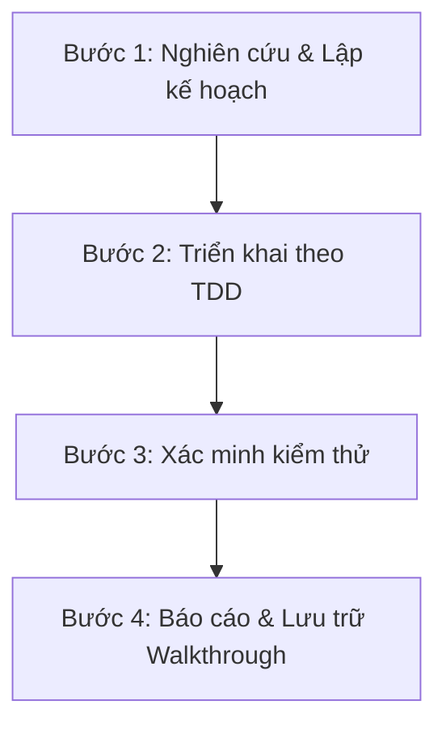

# Google-Standard AI Agent Rules & Workflows (.agents/AGENTS.md)

Tài liệu này định nghĩa các quy tắc (Rules) và quy trình làm việc (Workflows) chuẩn Google dành cho AI Coding Agent (Gemini/Claude) khi phát triển, bảo trì và sửa lỗi trong dự án này.

---

## 1. QUY CHUẨN LẬP TRÌNH (Coding Standards)

AI Agent cần tuân thủ nghiêm ngặt các quy chuẩn lập trình sau:

### A. Java & Spring Boot (Google Java Style Guide)
* **Quy tắc đặt tên:** 
  * Class/Interface: `UpperCamelCase` (ví dụ: `CustomerService`, `OrderRestController`).
  * Method/Variable: `lowerCamelCase` (ví dụ: `calculateTotalRevenue()`, `orderRepository`).
  * Package: Chữ thường hoàn toàn, phân tách bằng dấu chấm (ví dụ: `com.example.ht_vlxd.controller`).
* **Kiến trúc hệ thống:** Tuân thủ phân lớp chuẩn Spring Boot:
  * `Model (Entity)` -> `Repository` -> `Service` -> `Controller`.
  * Không thực hiện logic nghiệp vụ (business logic) trực tiếp trong Controller.
  * Không truy vấn database trực tiếp trong Controller; toàn bộ giao tiếp database phải qua Repositories được gọi từ Service.
* **Bảo mật:** Sử dụng Spring Security để kiểm tra quyền hạn. Các API/Route nhạy cảm phải được bảo vệ bằng `@PreAuthorize` hoặc cấu hình trong `SecurityConfig`.

### B. Cơ sở dữ liệu & SQL (Google SQL Style Guide)
* **Từ khóa SQL:** Viết hoa toàn bộ từ khóa SQL (ví dụ: `SELECT`, `INSERT INTO`, `WHERE`, `JOIN`, `ON`, `FOREIGN KEY`).
* **Đồng bộ thực thể (JPA/Hibernate):**
  * Đảm bảo các thuộc tính trong JPA Entity khớp chính xác với kiểu dữ liệu và ràng buộc trong [Database.sql](file:///d:/Learning/Projects/Construction_materials_management_system/Database.sql).
  * Sử dụng `@Column(name = "tên_cột_ở_sql")` rõ ràng.

### C. Frontend (Thymeleaf, CSS, JS)
* **HTML5 Semantic:** Sử dụng đúng thẻ ngữ nghĩa (`<header>`, `<nav>`, `<main>`, `<article>`, `<footer>`, `<aside>`).
* **Styling:** Sử dụng CSS thuần chất lượng cao (Sleek dark modes, Glassmorphism, Responsive Grid/Flexbox). Tuyệt đối không dùng các thư viện CSS ad-hoc chưa được khai báo trong dự án.
* **Thymeleaf integration:** Sử dụng các thẻ Thymeleaf standard (`th:text`, `th:if`, `th:each`, `th:action`) và tích hợp Spring Security trên giao diện bằng thư viện `thymeleaf-extras-springsecurity6` (ví dụ: `sec:authorize="hasRole('...')"`).

---

## 2. QUY TRÌNH PHÁT TRIỂN CHUẨN (Agent Workflow)

Khi thực hiện bất kỳ nhiệm vụ lập trình nào, AI Agent phải tuân thủ quy trình 4 bước chuẩn Google:



### Bước 1: Nghiên cứu & Lập kế hoạch (Research & Plan)
1. **Tìm kiếm ngữ cảnh:** Sử dụng `grep_search` và `list_dir` để tìm các class, repository hoặc giao diện liên quan trước khi sửa đổi.
2. **Lập kế hoạch:** Nếu thay đổi lớn hoặc cấu trúc phức tạp, phải viết file kế hoạch `implementation_plan.md` để người dùng xác nhận trước khi viết code.

### Bước 2: Triển khai & Viết Code (Implementation)
1. **Ưu tiên TDD (Test-Driven Development):** Viết unit/integration test trước hoặc song song với việc viết code tính năng.
2. **Giữ toàn vẹn mã nguồn:** 
  * Giữ nguyên các comment/docstring hiện tại không liên quan đến phần thay đổi.
  * Chỉ sửa đổi các vùng code cụ thể (sử dụng `replace_file_content` hoặc `multi_replace_file_content`), tránh ghi đè toàn bộ file lớn để giảm thiểu sai sót.

### Bước 3: Xác minh & Kiểm thử (Verification)
1. **Compile & Unit Test:** Chạy kiểm thử tự động để đảm bảo code mới không làm hỏng tính năng cũ:
   ```powershell
   .\mvnw.cmd clean test
   ```
2. **Kiểm tra giao diện (nếu có thay đổi UI):** Sử dụng công cụ browser subagent để truy cập trực tiếp `http://localhost:8080` nhằm kiểm tra tính hiển thị và phản hồi của giao diện.
3. **Log Audit:** Kiểm tra log runtime để đảm bảo không có SQLException hoặc NullPointerException tiềm ẩn.

### Bước 4: Hoàn thành & Báo cáo (Ship)
* Tạo hoặc cập nhật file `walkthrough.md` trong thư mục artifacts để mô tả chi tiết những thay đổi đã làm, kèm kết quả chạy test và ảnh/video xác minh giao diện.

---

## 3. RÀNG BUỘC ĐẶC THÙ DỰ ÁN (Workspace Constraints)

* **MySQL Password:** Database cục bộ của môi trường phát triển sử dụng mật khẩu rỗng (`spring.datasource.password=`). Tuyệt đối không tự ý thay đổi hoặc đẩy mật khẩu thực tế lên file cấu hình repository.
* **Port:** Ứng dụng chạy trên cổng mặc định `8080`. Không đổi cổng trừ khi có xung đột cổng được người dùng phê duyệt.
* **Không dùng dữ liệu giả (No Placeholders):** Tránh viết code mock hoặc placeholder tạm thời. Viết code xử lý logic thực tế và kết nối DB thật.
